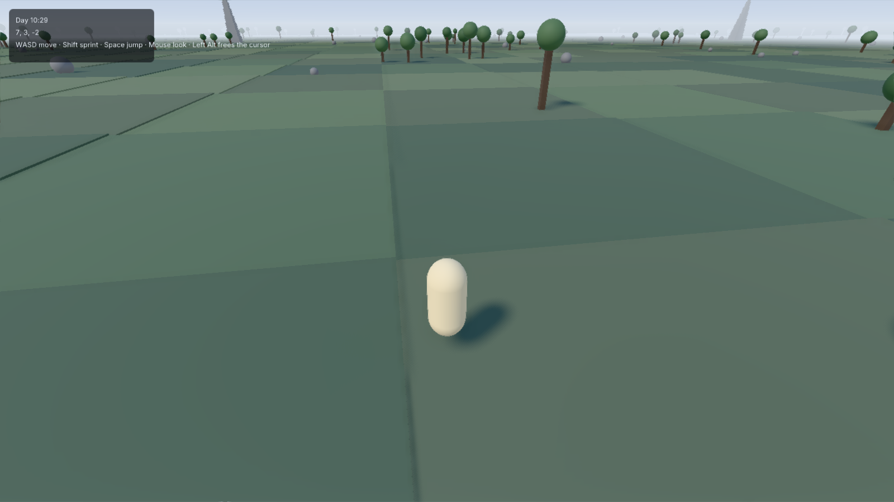
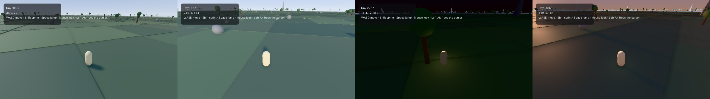

<picture>
  <source media="(prefers-color-scheme: dark)" srcset="branding/lockup-horizontal-dark.png">
  
</picture>

**A standalone, open-source game engine scripted in Luau — built for developers coming from Roblox.**

Ludwerk gives you the developer experience you already know — `Instance` trees, `game:GetService`, `task.spawn`, signals with `:Connect` — in an independent, professional engine: a modern C++ core embedding the Luau VM directly, a data-oriented ECS behind a familiar Instance facade, a swappable renderer and physics stack, deterministic fixed-tick simulation, and a code-first workflow (VS Code + CLI + sub-second hot reload). It targets complete 2D and 3D games, from small scenes to huge streamed open worlds, on desktop first, then mobile, with a console-ready architecture.

> **STATUS: `v2.0.0` is released**: the engine (`v1.0.0`), the visual editor
> (`v1.1.0`), and the phases after them -- materials as assets and surface
> shaders, sculpted terrain with caves, block worlds with flowing water,
> particles and decals, UI in the world, multiplayer with teams, ownership and
> rollback, navigation, and the 2D layer with joints and sprite animation. The engine boots a sandboxed Luau VM, opens a window, runs a
> deterministic fixed-tick simulation over an Instance tree on an ECS,
> hot-reloads a saved script into a new world in under two milliseconds, renders
> a world with cascaded shadows, clustered lights, image-based lighting and a
> post chain, simulates a thousand active rigid bodies in two milliseconds a
> tick, streams a world larger than it holds, and packages a game into a folder
> you can send to somebody.
>
> **Since `v2.0.0`, on `main`:** a game on an Android phone with touch
> controls; code in three script services -- `ServerScriptService` and
> `ClientScriptService` in each scene, `GlobalScriptService` for the whole game;
> scenes changed at run time with `SceneService:LoadScene`, every client
> following its server's; a match joined, hosted and left from a script; and
> attributes that replicate. **Being built:** one Export window for Windows,
> Linux, Android and dedicated servers. **Planned next:** cameras that draw
> into textures and scenes that run beside each other (ADR 0107), then an MCP
> server and an AI panel that can drive the whole engine (ADR 0108).
>
> **The deliverable is [`examples/10-open-world`](examples/10-open-world/)**: a
> third-person character walking four and a half kilometres of streamed terrain
> under a sun that crosses the sky, with a HUD, ambient sound, physics, and hot
> reload that puts you back where you were standing. A ten-minute soak of it at
> 1080p on the reference machine holds a **median of 5.35 ms** — one frame in
> 35,939 misses 60 fps — with memory flat and zero streaming hitches.
>
> **The review gate is not ceremony, and M8 is the best evidence yet.** Four of
> this milestone's defects came from a human running the flagship and saying what
> bothered them, while every gate in the repository was green: the world
> vibrating as you walk (the renderer never interpolated between ticks, and the
> scheduler had computed the factor for it since M1), the shadows crawling (three
> causes, the root being a character sliding off a tile corner), a pointer lock
> that was stored and read by nothing, and a camera that turned the way you did
> not push.
>
> It is written autonomously, milestone by milestone, by an AI agent (Claude
> Opus, multi-agent orchestration) following [`MASTER_PROMPT.md`](MASTER_PROMPT.md),
> with a human review gate at the end of every milestone.

  

  
   <em>One world, one property: <code>Lighting.ClockTime</code> drives the sky, the shadows, the fog and the exposure.</em>

## Where it is

| | Milestone | Gate |
|---|---|---|
| ✅ | **M0** — bootstrap: sandboxed VM, i18n'd log, pinned toolchain | signed off, `milestone/m0` |
| ✅ | **M1** — window, RHI (SDL3 GPU / capture / null), fixed-tick loop, screenshot + capture harness | signed off, `milestone/m1` |
| ✅ | **M2** — the kernel: ECS, Instance facade, deferred signals, `task`, services, world hash | signed off, `milestone/m2` |
| ✅ | **M3** — `ludwerk` CLI, hot reload, generated type definitions, conformance runner | signed off, `milestone/m3` |
| ✅ | **M4** — meshes, materials, camera, lighting; RHI interface freeze (ADR 0037) | signed off, `milestone/m4` |
| ✅ | **M4.5** — correcting the environment the renderer never read, and what was found beside it | signed off, `milestone/m4.5` |
| ✅ | **M5** — Jolt physics, queries, welds, and a character you can steer | signed off, `milestone/m5` |
| ✅ | **M6** — input actions, UI, tweens, audio, minimal animation; `examples/04-obby` | signed off, `milestone/m6` |
| ✅ | **M7** — asset pipeline, async IO, streaming, floating origin | signed off, `milestone/m7` |
| ✅ | **M7.5** — cascaded shadows, clustered lights, image-based lighting, post | signed off, `milestone/m7.5` |
| ✅ | **M8** — the flagship open-world demo, hardening, docs, v1.0 | released `v1.0.0` |
| ✅ | **E1–E9** — the visual editor: explorer, properties, manipulators, content, stamps, launcher, script editor and debugger | released `v1.1.0` |
| ✅ | **F1** — sculpted terrain: a grid of voxels with a material and an occupancy each, meshed with level of detail, a brush that digs into walls, streaming in cells | built; the flagship stands on it |
| ✅ | **V1** — `VoxelService`: blocks with images, see-through blocks, flowing and reacting fluids, streaming, an editor tool | built |
| ✅ | **F2** — `ParticleEmitter` and projected `Decal`s, soft particles | built |
| ✅ | **F3** — `SurfaceGui`, `BillboardGui` and rich text: UI drawn and pressed in the world | built |
| ✅ | **N1** — multiplayer: host, dedicated server and replica from one binary; prediction, interpolation, interest | playable on a LAN |
| ✅ | **N2** — a game's own messages, teams, network ownership, rollback and a published protocol | released `v2.0.0` |
| ✅ | **Android** — touch input, screen orientation, a game packaged as an APK | on `main`; plays on a phone |
| ✅ | **S1–S5** — three script services, scenes at run time, a match joined from a script, attributes that replicate, Play with players in the editor (ADRs 0105, 0106) | on `main` |
| 🔨 | **Export** — one window for Windows, Linux, Android and dedicated servers (ADR 0104) | in progress |
| 📋 | **Views** — a camera drawing into a texture, `ViewportFrame`, a scene running beside another (ADR 0107) | planned |
| 📋 | **AI** — one tool registry behind an MCP server and an AI panel, and autonomous runs (ADR 0108) | planned |

**What runs today.** `ludwerk new` scaffolds a project; `ludwerk dev` runs it with a
watcher, so a saved file rebuilds the world without the window closing;
`ludwerk build` turns it into a folder that runs on a machine with none of this
installed, wearing the game's own icon. In between: a streamed world of chunks
that arrive before you reach them, over a 64-bit floating origin; forward PBR
with four shadow cascades, clustered lights, image-based lighting from the sky
the engine draws, and a post chain of ambient occlusion, automatic exposure,
bloom and FXAA; Jolt with contacts surfaced as deferred `Touched` signals,
collision groups, queries, welds and a character that climbs, rides platforms and
is stopped by walls; rebindable input actions across keyboard, mouse and gamepad;
a UI tree over `UDim2` layout with real text; tweens, positional audio on the
simulation timeline, and skeletal animation. **Nearly 1,200** conformance cases written
against [`docs/api-design.md`](docs/api-design.md) — not against the
implementation — pass on Windows and Linux, beside a determinism harness that
replays recorded input and compares world hashes, a capture-stream gate that
compares draw commands rather than pixels, an editor-seam proof that runs two
worlds and two VMs in one process, and a soak that walks the flagship for ten
minutes and asserts the memory curve flattens.

**What it does not have, stated plainly.** No iOS, web or console targets, and
exports other than Windows are still being built. Multiplayer runs over an
unencrypted transport, with no matchmaking: finding a match is a backend you
write. No camera can draw into a texture yet. Each has an owner in the
roadmap's phases or a decision record rather than a shrug, and the manual's
*What is not here* page lists every gap with its state. A property the engine
stores and does not act on is marked `Inert` in the inspector and the api-dump,
and a gate stops a new one appearing quietly.

## Not affiliated with Roblox

Ludwerk is an independent project. It is **not** affiliated with, endorsed by, or sponsored by Roblox Corporation. Ludwerk replicates **public API concepts and idioms only** — it contains **no Roblox source code, no Roblox assets, no Roblox branding**, and it is not derived from any Roblox software. Luau is an open-source language (MIT) created by Roblox and used here under its license. **Luau is a trademark of Roblox Corporation. Ludwerk is an independent project, not affiliated with or endorsed by Roblox or the Luau team.** "Roblox" is a trademark of Roblox Corporation, referenced only nominatively.

## Why Ludwerk

- **Familiar, not identical.** Same concepts and idioms as the platform you came from (`Instance.new("Part")`, `Workspace`, `Touched:Connect(...)`, `TweenService`), but a clean, fully typed, deliberately improved API — deferred-only signals, real file modules instead of ModuleScripts, the modern Input Action System, SI units, `--!strict` everywhere.
- **Optimized by architecture.** Instance tree on the outside, data-oriented ECS on the inside. Native Luau `vector` as `Vector3` (zero-allocation script math). Atom-based property dispatch. Buffer-based bulk APIs. Fixed-tick deterministic simulation with interpolated rendering. Chunked streaming with 64-bit world coordinates and floating origin.
- **Swappable subsystems, sane defaults.** Renderer, RHI backend, physics, audio, and network transport all sit behind explicit seams selected at build time.
- **Open toolchain.** File-based projects, `.luaurc` + require-by-string, full `luau-lsp` support with generated type definitions, `rokit`-pinned tools, `pesde` packages, a CLI (`ludwerk`) running on the official Lute runtime.

## Default stack (pinned)

| Layer | Choice | License |
|---|---|---|
| Scripting VM | Luau **0.734** (embedded directly, `LUA_VECTOR_SIZE=3`) | MIT |
| Tooling runtime | Lute **1.0.0** (unmodified, CLI/tooling only) | MIT |
| Platform / window / input | SDL **3.4.x** | zlib |
| GPU | Custom RHI → **SDL3 GPU** (default backend); **bgfx** (mobile-phase backend) | zlib / BSD-2 |
| Shaders | HLSL via **SDL_shadercross** → SPIR-V / DXIL / MSL | zlib |
| Physics 3D | **Jolt 5.6** | MIT |
| Physics 2D (post-v1) | **Box2D 3.1** | MIT |
| Audio | **miniaudio 0.11.25** | MIT-0 / Unlicense |
| Assets | fastgltf (+ **simdjson 3.12.3**, its required parser) · meshoptimizer · basis_universal/KTX2 · stb (assimp: offline importer only) | MIT / Apache-2.0 / BSD / PD |
| Debug UI | Dear ImGui (docking) | MIT |
| Navigation (post-v1) | Recast & Detour | zlib |
| Net transport primitives | GameNetworkingSockets · ENet | BSD-3 / MIT |

Everything in the default path is permissively licensed. Exact pinned commits live in [`third_party/manifest.json`](third_party/manifest.json).

## Repository map

- [`MASTER_PROMPT.md`](MASTER_PROMPT.md) — mission constitution for the autonomous builder agent
- [`PROGRESS.md`](PROGRESS.md) — the build ledger (current state, session log)
- [`docs/architecture.md`](docs/architecture.md) — native core architecture (modules, layering, scheduler, ECS bridge, streaming)
- [`docs/api-design.md`](docs/api-design.md) — the Luau-facing API and developer experience
- [`docs/roadmap.md`](docs/roadmap.md) — milestones M0 through M8 with verification gates
- [`docs/decisions/`](docs/decisions/) — architecture decision records (ADRs)
- [`docs/research/`](docs/research/) — frozen research reports (Luau, Lute, ecosystem — August 2026)
- [`docs/migrating.md`](docs/migrating.md) — the migration guide (habit-by-habit mapping)
- [`docs/api/`](docs/api/) — the API reference, generated from the IDL
- [`CHANGELOG.md`](CHANGELOG.md) — what each release contains
- [`CONTRIBUTING.md`](CONTRIBUTING.md) — how contributions work

## v1 definition of done

A third-person character exploring a large open world with chunk streaming, Jolt physics, a simple day/night cycle, and live hot reload — plus a playable obby example, a physics playground, headless conformance/determinism test suites, and the `ludwerk` CLI. See [`docs/roadmap.md`](docs/roadmap.md).

## License

[Apache-2.0](LICENSE). See [`NOTICE`](NOTICE) and [`THIRD_PARTY_NOTICES.md`](THIRD_PARTY_NOTICES.md).
